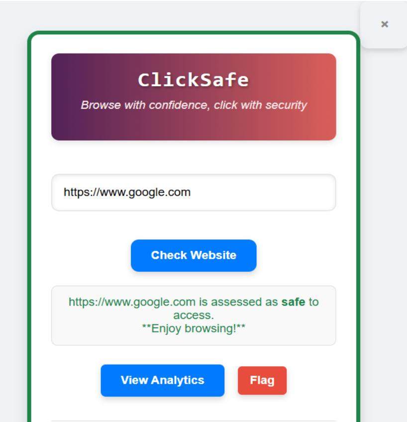
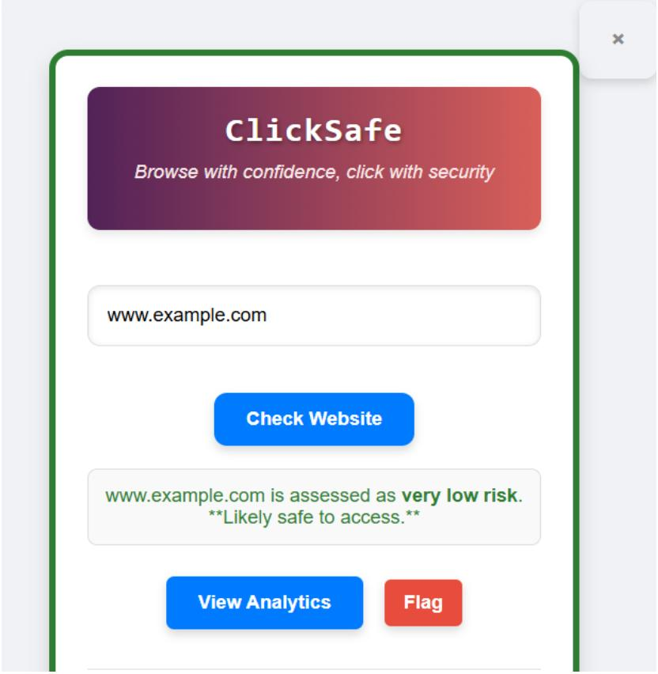
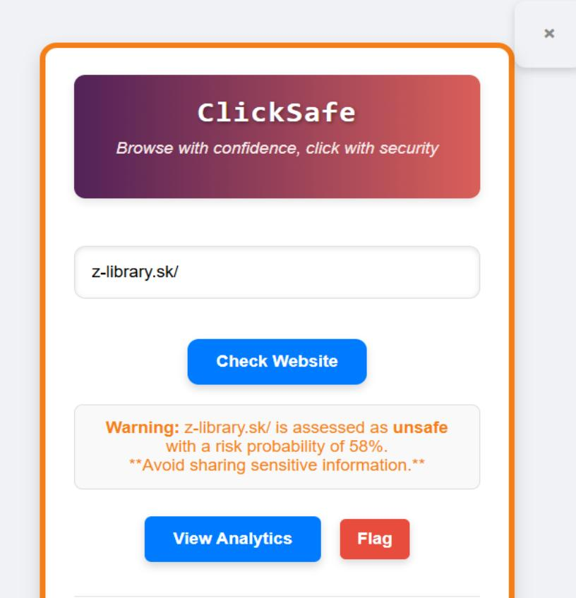
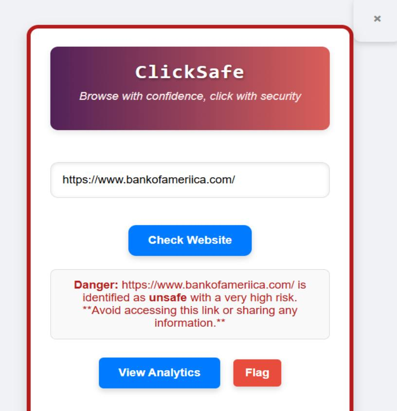
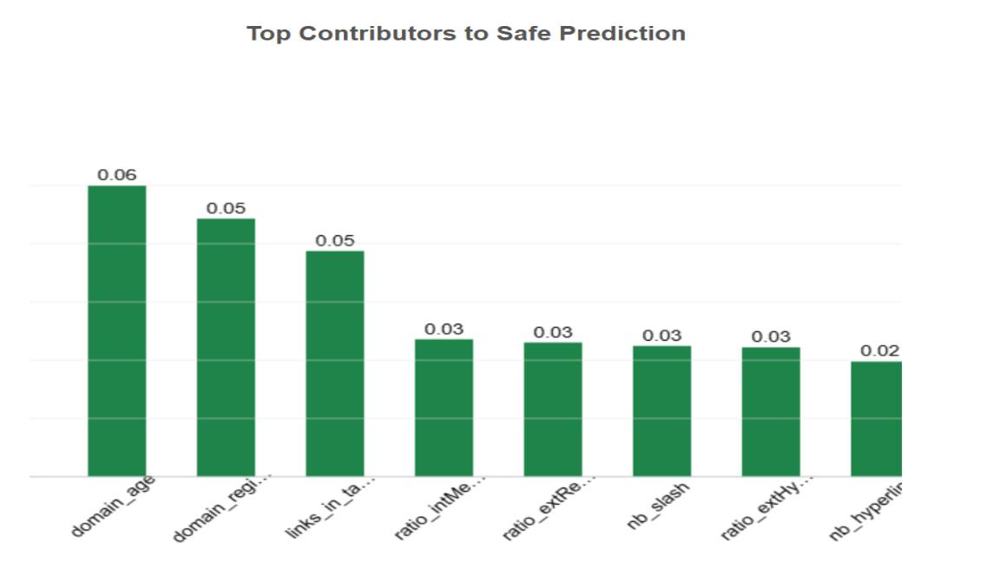
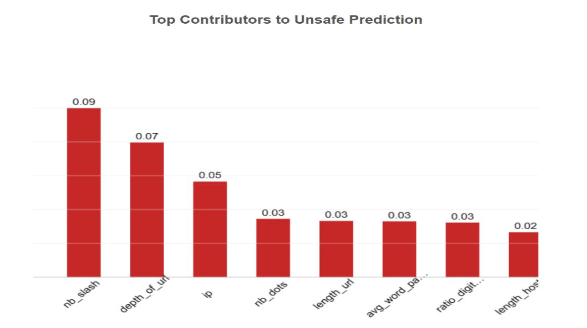

# ClickSafe — Dynamic Web Safety System

> **Browse with confidence, click with security.**

ClickSafe is a **Google Chrome extension powered by machine learning** that analyzes websites and predicts their safety level in real time. It extracts **50+ URL, host, and webpage-content features** and runs them through a **weighted ensemble of ML models** to detect suspicious or malicious websites — with **SHAP explainability** showing exactly why a prediction was made.

---

## Table of Contents

| | Section |
|---|---|
| 01 | [Demo](#demo) |
| 02 | [Key Features](#key-features) |
| 03 | [System Architecture](#system-architecture) |
| 04 | [Model Performance](#model-performance) |
| 05 | [Feature Categories](#feature-categories) |
| 06 | [ML Pipeline](#ml-pipeline) |
| 07 | [Project Structure](#project-structure) |
| 08 | [Installation](#installation) |
| 09 | [How It Works](#how-it-works) |
| 10 | [Technologies Used](#technologies-used) |
| 11 | [Dataset](#dataset) |
| 12 | [SHAP Explainability](#shap-explainability) |
| 13 | [Results](#results) |
| 14 | [Future Improvements](#future-improvements) |
| 15 | [Disclaimer](#disclaimer) |

---

## Demo

### Extension Popup

<div align="center">
<table>
  <tr>
    <th width="280">🟢 Safe</th>
    <th width="280">🟢 Very Low Risk</th>
  </tr>
  <tr>
    <td align="center"></td>
    <td align="center"></td>
  </tr>
  <tr>
    <td align="center"><code>google.com</code> — Safe</td>
    <td align="center"><code>example.com</code> — Very Low Risk</td>
  </tr>
  <tr>
    <th>🟠 Unsafe</th>
    <th>🔴 Danger</th>
  </tr>
  <tr>
    <td align="center"></td>
    <td align="center"></td>
  </tr>
  <tr>
    <td align="center"><code>z-library.sk</code> — Unsafe (58%)</td>
    <td align="center">Phishing URL — Danger</td>
  </tr>
</table>
</div>

### SHAP Analytics

<div align="center">
<table>
  <tr>
    <th width="420">Safe Prediction</th>
    <th width="420">Unsafe Prediction</th>
  </tr>
  <tr>
    <td align="center"></td>
    <td align="center"></td>
  </tr>
  <tr>
    <td align="center">Top contributors to a <strong>safe</strong> result</td>
    <td align="center">Top contributors to an <strong>unsafe</strong> result</td>
  </tr>
</table>
</div>

---

## Key Features

| Feature                   | Description                                                          |
| ------------------------- | -------------------------------------------------------------------- |
| **Dynamic Analysis**      | Extracts 50+ lexical, URL, host/domain, and webpage-content features |
| **ML Ensemble**           | Combines Random Forest, XGBoost, Gradient Boosting, and Extra Trees  |
| **Weighted Prediction**   | Ensemble weighting improves robustness and generalization            |
| **5-Level Risk Rating**   | Granular risk classification from Safe to Danger                     |
| **SHAP Explainability**   | Feature-level explanations for every prediction                      |
| **Chrome Extension**      | Clean popup UI for real-time risk assessment                         |
| **Interactive Analytics** | Visualizations of prediction factors and feature importance          |

### Risk Levels

| Level         | Color | Probability |
| ------------- | ----- | ----------- |
| Safe          | 🟢    | < 20%       |
| Very Low Risk | 🟢    | 20–30%      |
| Moderate Risk | 🟡    | 30–50%      |
| Unsafe        | 🟠    | 50–80%      |
| Danger        | 🔴    | ≥ 80%       |

---

## System Architecture

```
Chrome Browser + ClickSafe Extension
            │
            ▼
      URL Processing
            │
            ▼
    Feature Extraction
    ┌───────────────────┐
    │ • URL / Lexical   │
    │ • Host / Domain   │
    │ • Webpage Content │
    │ • 50+ Features    │
    └────────┬──────────┘
             │
             ▼
     ML Model Ensemble
    ┌───────────────────┐
    │ • Random Forest   │
    │ • XGBoost         │
    │ • Gradient Boost  │
    │ • Extra Trees     │
    └────────┬──────────┘
             │
             ▼
    Weighted Prediction
          ┌──┴──┐
          ▼     ▼
   Risk Level  SHAP Explanation
          └──┬──┘
             ▼
    ClickSafe Extension UI
```

---

## Model Performance

| Metric        |      Score |
| ------------- | ---------: |
| **Accuracy**  | **91.36%** |
| **Precision** |  **92.4%** |
| **Recall**    |  **89.2%** |
| **F1-Score**  |  **90.7%** |
| **ROC-AUC**   | **0.9744** |

> Among individual models, XGBoost achieved the highest accuracy at **91.72%**.

---

## Feature Categories

### 1. URL / Lexical Features

- URL length, depth, and structure
- Number of dots, subdomains, and parameters
- Digit ratio and suspicious character patterns
- HTTPS usage and URL shortening
- Suspicious prefixes/suffixes and uncommon TLDs
- Double-slash patterns

### 2. Host / Domain Features

- Domain age and registration length
- IP address usage and numeric domain detection
- Number of hyphens and hostname length
- Domain misspelling and brand matching
- Non-standard ports and TLD-related signals

### 3. Webpage Content Features

- Number and ratio of hyperlinks (internal vs external)
- External redirection ratio
- Links inside `<script>`, `<meta>`, and other HTML tags
- Domain presence in page title
- Internal/external media ratios
- External CSS count and phishing keyword hints

---

## ML Pipeline

```
Dataset → Data Cleaning → Feature Engineering → Missing Value Handling
    → Feature Selection → Train/Test Split (80/20)
    → Model Training (RF, XGBoost, GB, Extra Trees)
    → Weighted Ensemble → Risk Prediction → SHAP Explanation
```

---

## Project Structure

```
ClickSafe-DynamicWebSafety/
│
├── app.py                     # Flask backend
├── feature_extract.py         # Feature extraction logic
├── requirements.txt
│
├── manifest.json              # Chrome extension manifest
├── popup.html / popup.css / popup.js
├── background.js
├── analytics.html / analytics.js
│
├── *.pkl                      # Trained model files
├── Images/                    # Demo screenshots
└── README.md
```

> **Note:** Some `.pkl` model files exceed GitHub's size limit and are hosted separately on Google Drive.

---

## Installation

### 1. Clone the Repository

```bash
git clone https://github.com/sprahasingh/ClickSafe-DynamicWebSafety.git
cd ClickSafe-DynamicWebSafety
```

### 2. Install Python Dependencies

```bash
pip install -r requirements.txt
```

### 3. Download Trained Models

Download the `.pkl` files from Google Drive and place them in the project root.

**[Download Trained Model Files](https://drive.google.com/drive/folders/1Q2MQkctnP1X_57hdfHzMT_n73Hjtw2zG?usp=sharing)**

### 4. Run the Flask Backend

```bash
python app.py
```

### 5. Load the Chrome Extension

1. Open Chrome and go to `chrome://extensions/`
2. Enable **Developer mode**
3. Click **Load unpacked**
4. Select the `ClickSafe-DynamicWebSafety` directory
5. Ensure the Flask backend is running, then open any website

---

## How It Works

1. User visits a website and opens the ClickSafe extension
2. The URL and page content are sent to the Flask backend
3. 50+ features are extracted across URL, host, and content categories
4. Four ML models each generate a risk prediction
5. The weighted ensemble combines the predictions into a final score
6. A risk level (Safe → Danger) is assigned
7. SHAP identifies the top contributing features
8. The extension displays the risk level and explanation

---

## Technologies Used

| Technology                  | Purpose                         |
| --------------------------- | ------------------------------- |
| **Python**                  | Backend and ML pipeline         |
| **Flask**                   | REST API backend                |
| **scikit-learn**            | ML models (RF, GB, Extra Trees) |
| **XGBoost**                 | Gradient boosting classifier    |
| **SHAP**                    | Model explainability            |
| **HTML / CSS / JavaScript** | Chrome extension UI             |
| **Chrome APIs**             | Browser integration             |
| **Joblib / Pickle**         | Model serialization             |

---

## Dataset

- **Sources:** Kaggle, PhishTank, Government websites, Custom crawling
- **Size:** 100,000+ instances, 50+ features
- **Balance:** Safe 51.74% / Unsafe 48.26%
- **Split:** 80% train / 20% test (with validation during tuning)

---

## SHAP Explainability

ClickSafe uses **SHAP (SHapley Additive exPlanations)** so users understand _why_ a prediction was made — not just what the verdict is.

For an **unsafe** prediction, top contributing features might include:

- High slash count in the URL
- Suspicious URL depth
- IP address used instead of a domain name

For a **safe** prediction, top contributing features might include:

- Established domain age
- Long registration period
- High ratio of internal links

---

## Results

- **91.36%** overall accuracy
- **92.4%** precision / **89.2%** recall / **90.7%** F1-score
- **0.9744** ROC-AUC
- **50+** engineered features across 3 categories
- **4** ML classifiers in a weighted ensemble
- **5** user-facing risk levels
- Full SHAP-based prediction explanations

---

## Future Improvements

- Deep learning models for webpage-content analysis
- Real-time threat-intelligence feed integration
- Behavioral and JavaScript-based website analysis
- Multimodal detection (text + images + URL)
- Cloud deployment with scalable APIs
- Continuous learning from user feedback
- Cross-browser and mobile browser support

---

## Disclaimer

ClickSafe is an academic machine-learning project for website-risk assessment. Predictions should not be treated as a guarantee that a website is safe or malicious.

---

## Author

**Spraha Singh** · [GitHub](https://github.com/sprahasingh)
